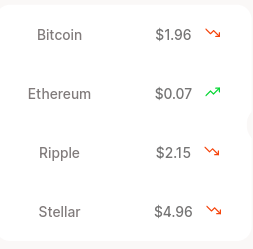
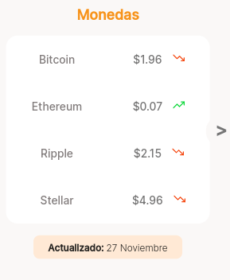
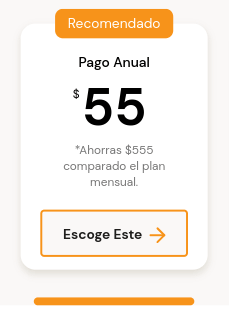

# :iphone: Landing Mobile First

**Visitala** haciendo click :point_right: [aquí](https://guadamongebarale.github.io/LandingMobileFirst/index.html) :point_left:

---

## Te expico algunos de los conceptos que apliqué en el proyecto

---
---

### :fire: Maquetación Responsive Dising: Mobile First

Mobile first presenta varias ventajas sobre el maquetado tradicional (primero web y luego móvil):

* Escalar el proyecto es mucho más fácil

* Mejor experiencia de navegación 

* Reduce el peso o tamaño de la página, lo que afecta notablemente a la velocidad de carga

* Los navegadores le dan prioridad a este tipo de diseño, por lo que es ideal para el SEO

* Cada vez son más los expertos que concuerdan en que esta no es una tendencia, sino un **standar en la industria**

### :sunglasses: Buenas prácticas de ordenamiento de estilos en CSS

1- Posicionamiento --> static, absolute, relative, fixed.

2- Modelo de caja (Box model) --> margin, border, padding, content.

3- Tipografía --> tipos, tamaños de fuente, etc.

4- Estilos visuales --> box-shadow, border-radius, gradient, etc.

5- Otros --> misceláneos, reglas CSS y más.

---
### :relaxed: Metodología BEM

BEM (Block, Element, Modifier o Bloque, Elemento, Modificador) es una metodología ágil de desarrollo basada en componentes. Divide toda la interfaz en bloques que se pueden reutilizar y escalar.

* .block {}

* .block__element {}

* .block--modifier {}

---
### :sunny: CSS Grid 

Grid permite alinear elementos en columnas y filas convirtiendo al contenedor en una grilla.

Es la especificación de CSS idónea para trabajar las tablas. 

* Creamos la grilla: `display: grid;`

* Definimos 2 Columnas: `grid-template-columns: repeat(2,140px);`

* Ajustamos el tamaño de las filas que sean necesarias: `grid-auto-rows: 60px;`

* Centramos los elementos horizontal y verticalmente: `place-items: center;`

---
### :wink: HTMLStyleElement 

Podemos manipular propiedades CSS especificadas utilizando JavaScript.

Lo implementé, en la versión para móvil, con el fin de navegar entre las diferentes tablas.

`document.querySelector(".main-commissions-table").style.display = "block";`
`document.querySelector(".main-currency-table").style.display = "none";`

---
### :bowtie: Scroll CSS

La propiedad `overflow` especifica lo que debería suceder si el contenido desborda.

Su valor puede ser `scroll`.

Luego con `scroll-behavior` especificamos el comportamiento.

Para personalizar la barra de desplazamiento implementamos el pseudo elemento `webkit-scrollbar`

Puedes verlo la sección "Planes" 

---
### :blush: flex-wrap

Con la propiedad flex-wrap de Flexbox podemos especificar si los elementos  son obligados a permanecer en una misma línea o pueden fluir en varias.

Si esto lo combinamos con order logramos modificar la apariencia  de una sección de móvil a web con muy pocas líneas de CSS. 

